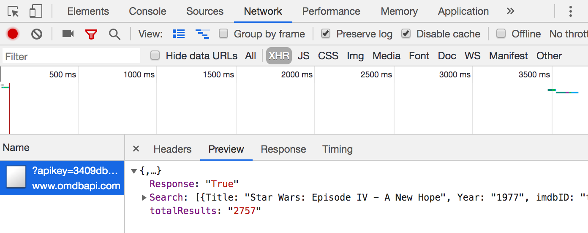

# OMDB Redux (check here at the top for updated instructions)

Welcome to pass # 2 of the OMDB api.  This was a tough assignment, but with a little extra time we can get through it.  Also, if things feel overwhelming don't sweat it too much.  This is a deliberately broad assignment in preparation for P1.  We'll go over it before the project.

### Final App Goals

- A text input + button for searching OMDB by _movie title_
- Display a list of movies returned by the search api call.  At least the movie's title and poster should be visible.
- An event listener either on the movie's poster or a button near the movie's title that will allow a user to "select" or "view more info" about the movie.  The listener should make a second api call to fetch information about the movie.
- If a movie is "selected" as described in the previous item, display that movie's director and actors from the movie.  If a second movie is "selected" remove the data from before and just display the second movie's data at the top of the page.

### Reduxing

You are encouraged to either start from scratch or at least try to reset from before.  This should help both getting a second pass if you were able to complete it last night or get a reset if need be.

Here is a compressed and totally not mandatory suggested guide for getting through the task:

- First, add the text input and button to the html file
- Attach an event listener that simply logs the text value of the input
- Next, add the `axios` api call.  For searching, the url should look something like this: `http://www.omdbapi.com/?apikey=[yourkey]&s=[movietitle]`
- Remember to use `async` and `await` for the axios calls
- Try to console.log the search results.  Or use the `network` tab in the dev tools + the preview tab for a request ot view its structure.

For this first bit, you should be able to verify in the console that you are successfully retrieving information from omdb.

- Next, write a method `renderList` that receives an array of "movie" objects as a parameter.  Call `renderList` from the event handler you wrote in the previous step and pass it the Search results from the axios response
- `renderList` should iterate over the movies it receives as an argument and insert the movie data from each object into the DOM as a new HTML element.

Before moving on, try to verify that you can enter text into the text input, click the button, and then see a list of movies appear on the page

_The Finale_

- Go back to the movie list.  Add a button to each movie in the list.  
- When a user clicks on this button, pass the movie's id or title to the omdb api to fetch more information about the movie, e.g., `http://www.omdbapi.com/?apikey=[yourkey]&t=[movietitle]` or `http://www.omdbapi.com/?apikey=[yourkey]&i=[movieId]`.  Try to console log or display the url for each button and test it in the browser's navigation bar if you're having issues with this step
- Using the data returned from the api, display the movie's additional data at the top of the page as outlined above in the project goals section

# Old (and slightly outdated) directions

## OMDB Api

### Introduction

In this exercise you will fetch movie data from the [OMDB Api](http://www.omdbapi.com/) and render it in the browser.

First, head over to the OMDB website and sign up for your own API key (free option is perfectly fine). Next, check out the documentation under the "Usage" tab. Here you will find instructions on how to structure your endpoint for your axios calls. You can also find different parameters to use and what they are for. Remember, every API is different so you will need to read into what works for this API.

### Starter Code

If you look at the files we've given you, you will find some basic HTML to get you started. In the Javascript file, we've set you up a base url for your endpoint. All you need to do is plug in your API key and add your parameter to the end.

### Requirements

The (final) version of the app should include the following functionality:

- Upon page load, display a list of movies; at least the title and poster should be rendered
- A user should be able to click on either the poster for each movie or a button near the title that triggers a second API call to fetch details for that movie which is then displayed at the top of the page (refer back to our event handler lesson if you need help with this). Include at least the Director and Actors for the movie in the detail section
- If a user clicks on a second movie's button/poster, replace the details at the top with the second movie's information

### ** Bonus **

Once the above is complete, try adding an input field and button that when filled in and submitted replaces the original movie list with a new list matching the search term from the input.

